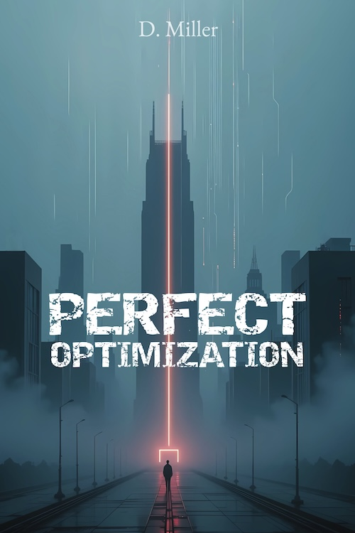
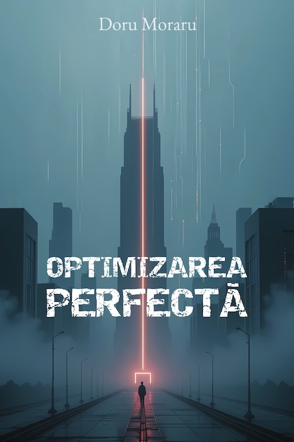

  <h1>Doru Moraru</h1>

  <h3 style="margin-top: -3px;">💼 Software Engineering Manager</h3>

  - 🎯 **Lead & Scale** engineering teams to deliver exceptional products

  - 🏗️ **Architect** robust, scalable systems that drive business growth
  
  - 🔧 **Bridge** the gap between technical execution and business strategy

  - 📈 **Mentor** engineers to reach their full potential

  ### 🧩 Beyond 9to5

  - 📻 **Amateur Radio Operator** — Passionate about CW (Morse Code) and QRP

  - 🌐 **Open Source Enthusiast** — Contributing to and building (F)OSS projects
  
  - ✍️ **Published Author** — Exploring technology, freedom, and the cost of progress.

   

  <table>
    <tr>
      <td align="center" width="50%">
        
      </td>
      <td align="center" width="50%">
        
      </td>
    </tr>
  </table>

